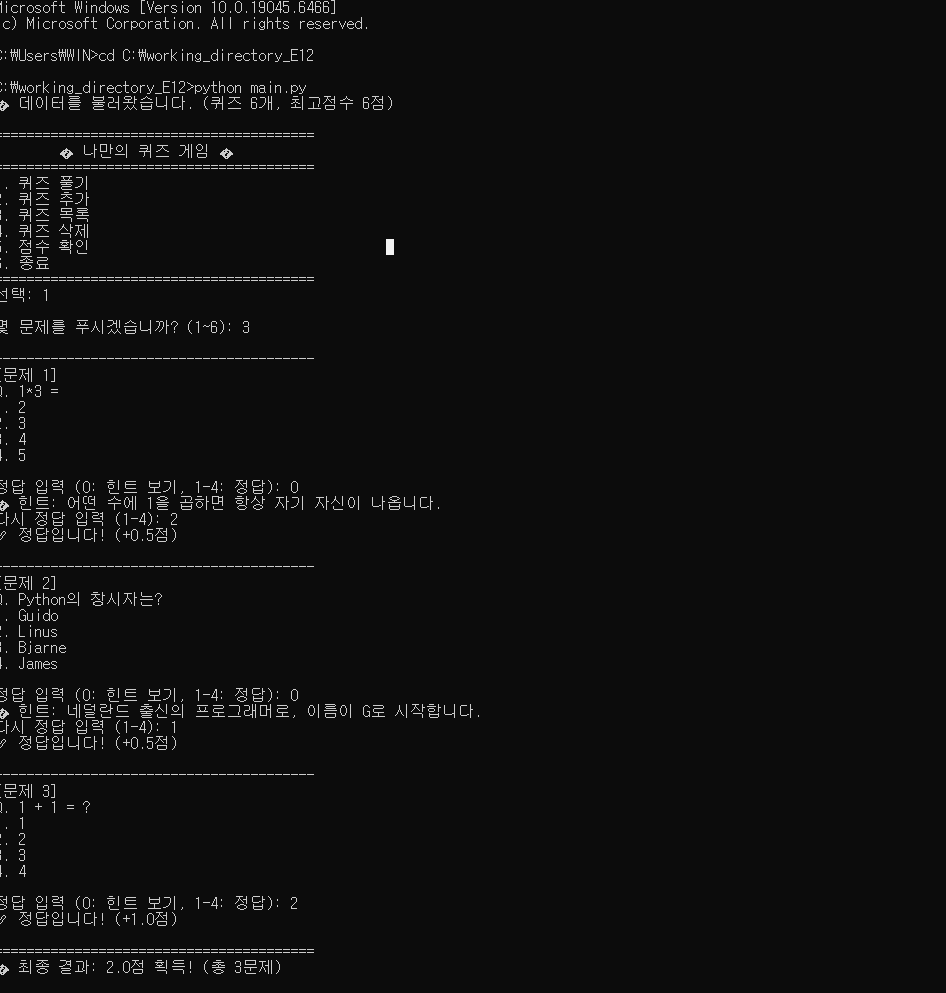
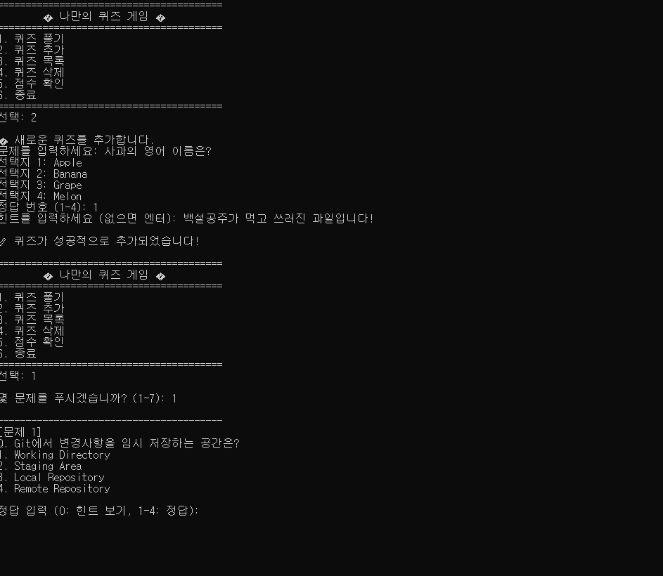
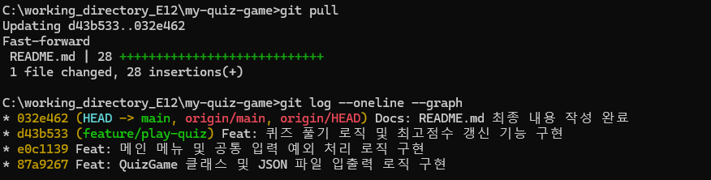

# 🎯 나만의 퀴즈 게임 (My Quiz Game)

## 1. 프로젝트 개요
Python과 Git을 학습하며 터미널에서 직접 동작하도록 만든 객체 지향 기반의 퀴즈 게임입니다. 

## 2. 퀴즈 주제 선정 이유
개발환경과 파이썬과 관련한 문제를 선정

## 3. 실행 방법
터미널(또는 명령 프롬프트)에서 아래 명령어를 입력하여 실행합니다.
`python main.py`

## 4. 기능 목록
- 퀴즈 풀기 (정답 확인 및 최고 점수 갱신)
- 퀴즈 추가 (사용자가 직접 문제와 선택지 등록 가능)
- 퀴즈 목록 보기
- 점수 확인

## 5. 파일 구조
- `main.py` : 게임 로직(Quiz, QuizGame 클래스)과 실행 코드가 포함된 메인 파일
- `state.json` : 퀴즈 데이터와 최고 점수를 유지하기 위한 저장 파일
- `.gitignore` : Git에 올리지 않을 파일 목록
- `README.md` : 프로젝트 설명 문서

## 6. 데이터 파일 설명 (`state.json`)
- 프로그램 종료 후에도 데이터를 유지하기 위해 사용됩니다.
- `quizzes`: 각 퀴즈의 문제, 선택지, 정답 번호가 리스트로 저장됩니다.
- `best_score`: 현재까지의 최고 정답 개수를 숫자로 저장합니다.

## 7. Git 워크플로우 실습 기록
이 프로젝트는 미션 요구사항을 충족하기 위해 다양한 Git 명령어를 활용하여 진행되었습니다.

- **브랜치 생성 및 병합 (Branch & Merge)**
  - 메인 퀴즈 풀기 기능을 안전하게 개발하기 위해 `feature/play-quiz` 브랜치를 생성하고 이동했습니다. (`git checkout -b feature/play-quiz`)
  - 해당 브랜치에서 퀴즈 풀기 기능과 최고 점수 갱신 로직을 구현 후 커밋했습니다.
  - 기능 개발 완료 후 다시 `main` 브랜치로 이동하여 작업 내역을 병합했습니다. (`git checkout main`, `git merge feature/play-quiz`)

- **원격 저장소 복제 및 동기화 (Clone & Pull)**
  - 협업 상황을 가정하여, 원격 저장소를 새로운 로컬 디렉터리(`clone-test`)에 복제했습니다. (`git clone`)
  - 복제된 환경에서 `README.md` 파일을 수정하고 푸시(Push)했습니다.
  - 다시 원래의 작업 환경(`my-quiz-game`)으로 돌아와서 업데이트된 내용을 성공적으로 가져왔습니다. (`git pull`)
  - 
## 8. 실행 화면 및 결과
**게임 플레이**

**Git 로그**

**Git 브랜칭 및 병합 전략**
* **브랜치 생성:** 독립적인 개발 환경을 위해 기능(feature) 브랜치를 생성했습니다. `git log`에서 볼 수 있듯이, 퀴즈 로직 구현을 위해 `feature/play-quiz` 브랜치를 생성하여 작업했습니다.
* **병합 (Merge):** 기능 개발이 완료된 후, `feature/play-quiz` 브랜치를 `main` 브랜치로 병합했습니다. 작업 기간 동안 `main` 브랜치에 다른 커밋이 발생하지 않았기 때문에, Git은 깔끔한 **Fast-forward 병합**을 수행했으며, 그 결과 첨부된 스크린샷과 같은 선형적인 커밋 히스토리가 남게 되었습니다.

## 9. 보너스 기능 구현 (선택 과제)
기본 요구사항을 모두 충족한 후, 추가적인 학습을 위해 아래의 보너스 기능들을 모두 구현했습니다.

- **랜덤 출제 및 문제 수 선택**
  - `random` 모듈을 활용하여 퀴즈 출제 시 문제 순서가 매번 다르게 섞이도록 구현했습니다.
  - 게임 시작 전, 전체 퀴즈 중 몇 문제를 풀 것인지 사용자가 직접 입력하여 선택할 수 있습니다.
- **힌트 기능 적용**
  - `Quiz` 클래스에 `hint` 속성을 확장하여 퀴즈 데이터를 더 풍부하게 만들었습니다.
  - 문제 풀이 중 사용자가 힌트를 요청할 수 있으며, 힌트 사용 시 최종 획득 점수가 차감되는 로직을 추가했습니다.
- **퀴즈 삭제 기능**
  - 등록된 퀴즈 목록에서 불필요한 퀴즈를 선택해 삭제할 수 있는 기능을 추가했습니다.
  - 삭제 후 파일 저장 메서드를 호출하여 `state.json` 파일에 즉시 동기화되도록 처리했습니다.
- **점수 기록 히스토리 관리**
  - 단순한 최고 점수뿐만 아니라, `datetime` 모듈을 활용하여 사용자의 모든 게임 플레이 기록을 누적하여 저장합니다.
  - 날짜/시간, 플레이한 문제 수, 최종 획득 점수가 파일에 함께 기록됩니다.
